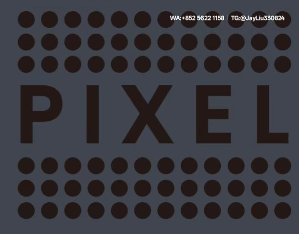

# Facebook广告精准运营进阶指南

---

## 一、多层次受众运营体系
### 1.1 用户生命周期管理
**三阶段培育模型**
- **认知期**：通过兴趣词组合+类似受众快速拓新
- **互动期**：针对视频完播用户推送产品对比广告
- **转化期**：为历史加购用户配置独家优惠方案

---

## 二、核心投放策略配置
### 2.1 测试账户操作规范
- **初始设置**
  每日预算 $50-80 | 3个广告组并行测试
  使用CBO自动分配预算

- **数据监控**
  | 指标         | 优化动作                          | 淘汰阈值     |
  |--------------|----------------------------------|--------------|
  | CPM         | 暂停3小时后转时段重启              | >$15         |
  | CTR         | 插入热点问题悬念式标题             | <1.2%        |
  | ROAS        | 追加类似兴趣词进行AB测试           | <1.5         |

---

## 三、创意引擎配置方案
### 3.1 素材智能库管理
**三层架构体系**
| 层级       | 更新频率   | 调用场景        | 管理规则          |
|------------|------------|-----------------|-------------------|
| 主力素材   | 每72小时   | 购买转化目标    | ROI<1.8即淘汰     |
| 候补素材   | 实时更新   | 流量低谷时段    | CTR保持≥2%       |
| 实验素材   | 每日入库   | 新客获取时段    | 最多保留7天       |

### 3.2 动态版位优化矩阵

graph LR
高CPM时段 --> 启用购物标签页+视频插播
正常时段 --> 主投信息流+动态产品广告
低转化时段 --> 切换Messenger+Marketplace

---

## 四、再营销技术方案
### 4.1 自定义受众分层
| 用户行为               | 培育策略                | 预算占比 |
|------------------------|-------------------------|----------|
| 浏览未加购             | 场景解决方案广告         | 25%      |
| 加购未支付             | 动态库存警示+限时优惠    | 40%      |
| 购买记录用户           | 配件组合推荐             | 35%      |

### 4.2 组合投放规则
- **基础配置**
  排除30天转化用户
  每周重置兴趣词库

- **智能升级**
  配置备件广告组自动替补机制
  当主广告组频次＞3次/周时启动轮换

---

## 五、数据驱动运营机制
### 5.1 健康度诊断系统
**五维监控模型**
- 素材衰减率 ≤20%
- 兴趣词匹配度 ≥65%
- 受众更新时效 ≤72h
- 预算波动幅度 ≤30%
- 时段转化偏差 ≤25%

### 5.2 智能应急方案
**三级响应机制**
| 告警等级 | 触发条件             | 执行方案                     |
|----------|----------------------|------------------------------|
| Level1   | CTR降幅＞15%持续6h  | 自动替换标题+主图            |
| Level2   | CPM突增＞35%         | 暂停投放+转时段重启          |
| Level3   | ROAS＜1持续12h      | 切换广告系列+重建受众        |

---

## 六、团队协作标准
### 6.1 素材生命周期记录

文件名格式：日期_产品线_负责人_版本
示例：20240422_美妆_John_V3

### 6.2 效果追踪模板
| 广告组ID | 初始CTR | 当前CTR | 投放天数 | 操作记录                 |
|----------|---------|---------|----------|--------------------------|
| 38976A   | 1.5%    | 2.3%    | 7        | Day3更换首帧             |
| 48921B   | 2.1%    | 0.9%    | 5        | Day2增加兴趣词           |
